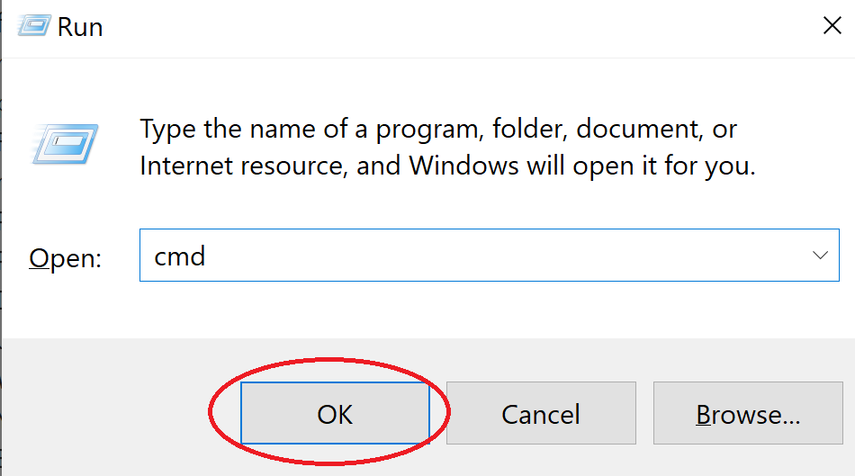
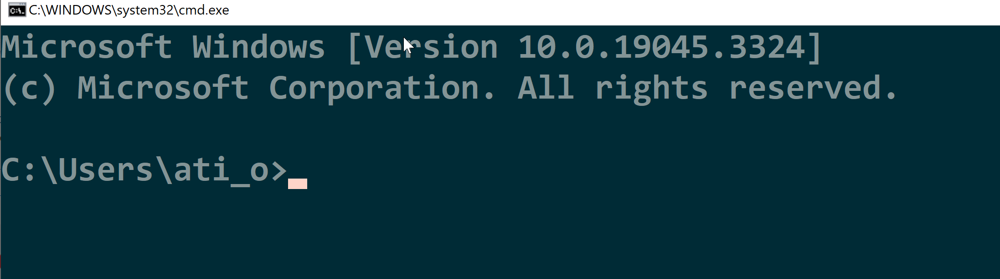

# Komut satırı

Komut satırı, Python programlarımızı çalıştırdığımız yerdir.
Linux'ta bir komut satırı örneğini aşağıda görebilirsiniz:

Windows'ta komut satırını iki şekilde açabiliriz.

## Çalıştır menüsünü kullanarak komut satırını açma

1. Çalıştır menüsünü kullanarak Windows+R tuşlarına basın ve cmd yazın.

2. 
Komut satırını (Windows) / Terminal'i (MacOS) açtıktan sonra, kaynak dosyalarımızın bulunduğu dizine gidip aşağıdaki komutu çalıştırıyoruz.

Burada **cd**, dizini değiştir (change directory) anlamına gelir.
Ana dizinden başlıyoruz, oradan Masaüstü ve Python kodları dizinine gidiyoruz.
Örnek bir merhaba dünya programı çalıştırmak için python hello.py yazın.

hello.py'yi programınızın adıyla (örneğin "program_adi.py") değiştirmeyi unutmayın.

	cd Desktop
	cd python-kod
	python hello.py

## Explorer'da cmd yazın

Python dosyalarınızın bulunduğu klasöre gidin.
Aşağıdaki "C:\\Users\\ati_o\\Desktop\\python-codes"

Adres çubuğuna aşağıdaki gibi **cmd** yazın:

Bu klasörde yeni bir **cmd** penceresi açılacaktır.
Örnek bir merhaba dünya programı çalıştırmak için python hello.py yazın.
hello.py'yi programınızın adıyla değiştirmeyi unutmayın, örneğin "program_name.py"

	python hello.py

## Video Öğreticileri

Aşağıdaki ingilizce vidyolarda bu konuda daha fazla bilgi bulabilirsiniz.

- [Video: What is Command Line](https://youtu.be/qY4rgXIiY3U)
- [Video: What is the difference between Cmd, PowerShell, and Bash](https://youtu.be/nahtw_csB5w)
- [Video: Windows Command Line Tutorial #1 - Introduction ](https://youtu.be/8-Bnm9LxG6A)
