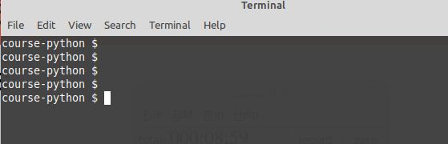
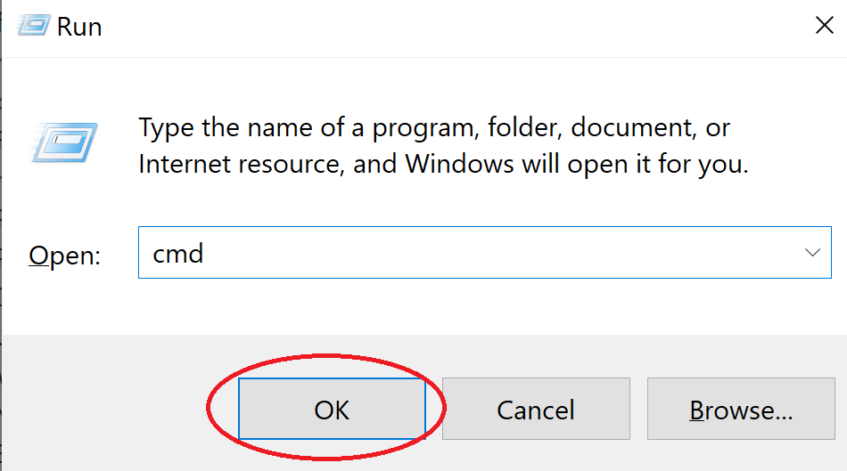
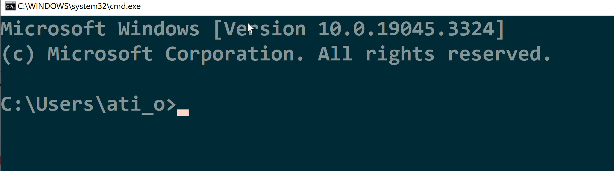
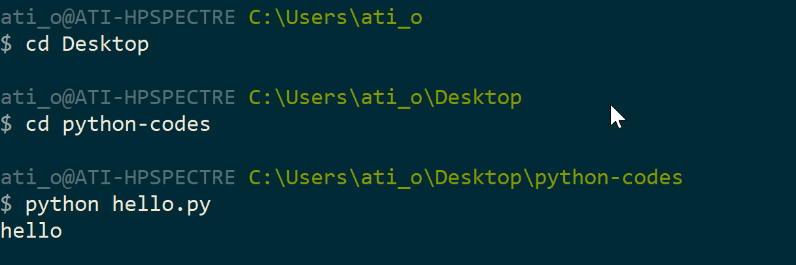

# command-line

Command line is where we execute our python programs.
You can see an example of command line in linux below:

We can open command line in windows two ways.

## opening command line using run menu

1. Using run menu, use Windows+R and write cmd

2. 
After we open command line (windows) / Terminal (MacOS), we go to directory of our source files and run following command.
Here **cd** means change directory.
We are starting in our home directory, from there going to Desktop and python-codes directory.

	cd Desktop
	cd python-codes
	python hello.py

## In Explorer writing cmd

## Video Tutorials
See below videos for more information.

- [Video: What is Command Line](https://youtu.be/qY4rgXIiY3U)
- [Video: What is the difference between Cmd, PowerShell, and Bash](https://youtu.be/nahtw_csB5w)
- [Video: Windows Command Line Tutorial #1 - Introduction ](https://youtu.be/8-Bnm9LxG6A)
