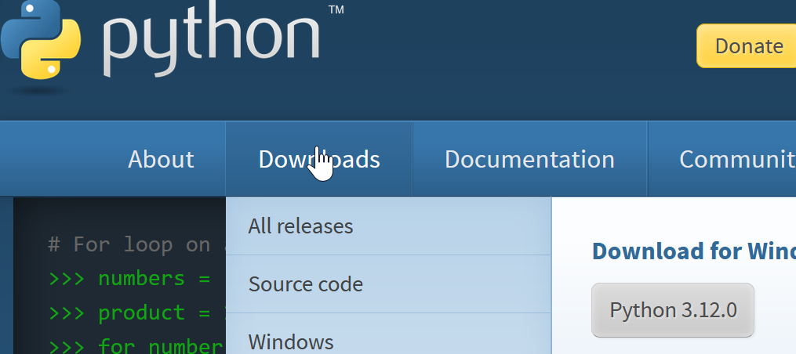

# python installation

Go to [python.org](https://www.python.org/). 
When you go to Downloads link, it will show you latest python version according to your operation system.
Download it and install it in your computer.
For windows and MacOS, installer is very easy, a next click installer.

You can see a short python installation video below:

[Video: Install Python and IDLE](https://youtu.be/vUdVNWyAUAU)

