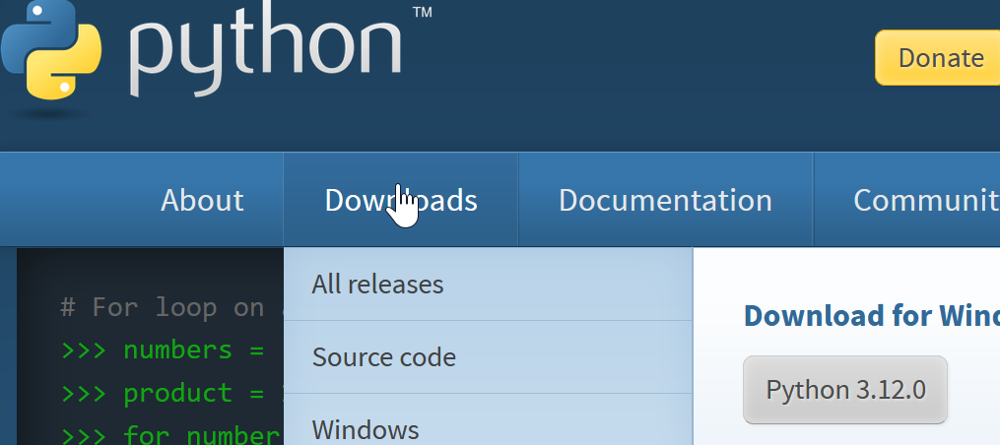

# python Kurulumu

[python.org](https://www.python.org/) web sitesiniz açınız.
İndirmeler bağlantısına gittiğinizde, işletim sisteminize göre en son Python sürümü gösterilecektir.
İndirin ve bilgisayarınıza kurun.
Windows ve MacOS için kurulum oldukça kolaydır, bir sonraki tıklamayla kurulum tamamlanır.

Aşağıda kısa bir Python kurulum videosunu izleyebilirsiniz:

TODO

