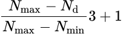

## Academic grading in Germany using Modified Bavarian formula

Please write a code which calculates Modified Bavarian formula.

.

You need to ask minimum possible grade, maximum possible grade and actual grade from the user.

You can see more information about [academic grading in Germany](https://en.wikipedia.org/wiki/Academic_grading_in_Germany).

