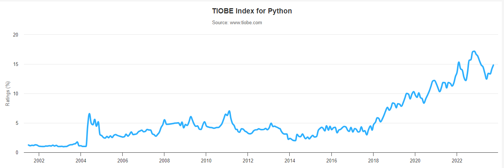
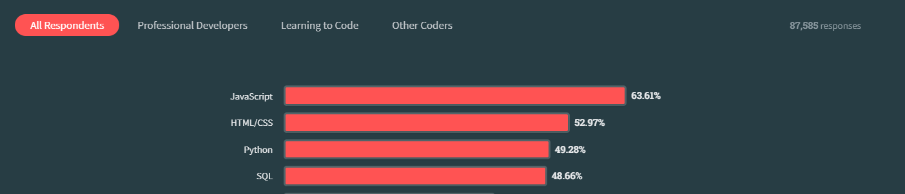

#  Why learn python

As of 2023, Python is number ONE programming language in the [Tiobe index for programming languages](https://www.tiobe.com/tiobe-index/).
According [the same index](https://www.tiobe.com/tiobe-index/python/), python are

 - Highest Position (since 2001): #1 in Sep 2023
 - Lowest Position (since 2001): #13 in Feb 2003
 - Language of the Year: 2007, 2010, 2018, 2020, 2021

Similarly, according to [Stackoverflow 2023 Survey](https://survey.stackoverflow.co/2023/#most-popular-technologies-language), python is the 3rd popular programming language among the 87,585 respondents.

You can see similar information in [google trends](https://bit.ly/2kjMj3j) also.

