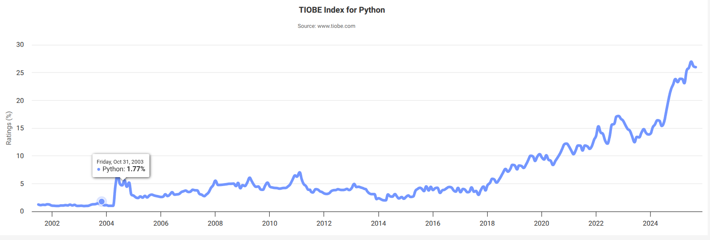
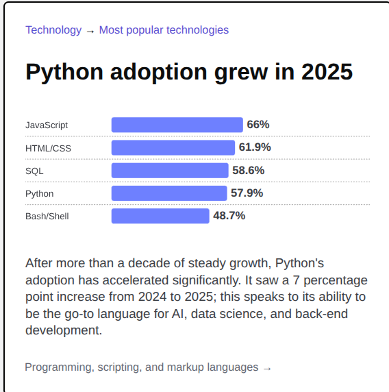

# Neden python öğrenelim

Programlama dillerini sıralayan [Tiobe index](https://www.tiobe.com/tiobe-index/)'e göre python, 2023,2024 ve 2025'te 1. sıradadır.
Aynı [listeye göre python](https://www.tiobe.com/tiobe-index/python/):

 - En yüksek 2001'den beri: #1 Eylül 2025
 - En düşük 2001'den beri: #13 Şubat 2003
 - Yılın dili:  2007, 2010, 2018, 2020, 2021, 2024

Benzer şekilde [Stackoverflow 2025 Anketine](https://survey.stackoverflow.co/2025/#most-popular-technologies-language) göre, python 4. sıradadır ve python kullanılamasının artışı anket ana başlıkları arasında verilmiştir.

Python'un javascript ve java ile karşılaştırılmasını [google trends](https://bit.ly/2kjMj3j) üstünden görebilirsiniz.

## Neden python öğrenelim Özet

Genel bir programlama dili olarak python, web, UI, veri işleme gibi bir çok kütüphane sunmasına rağmen son 10 yılda bilimsel programlama dili olarak çok öne çıkmıştır. Yapay zeka, veri bilimi gibi konuları öneminin artması ile populerliği çok artmıştır.

